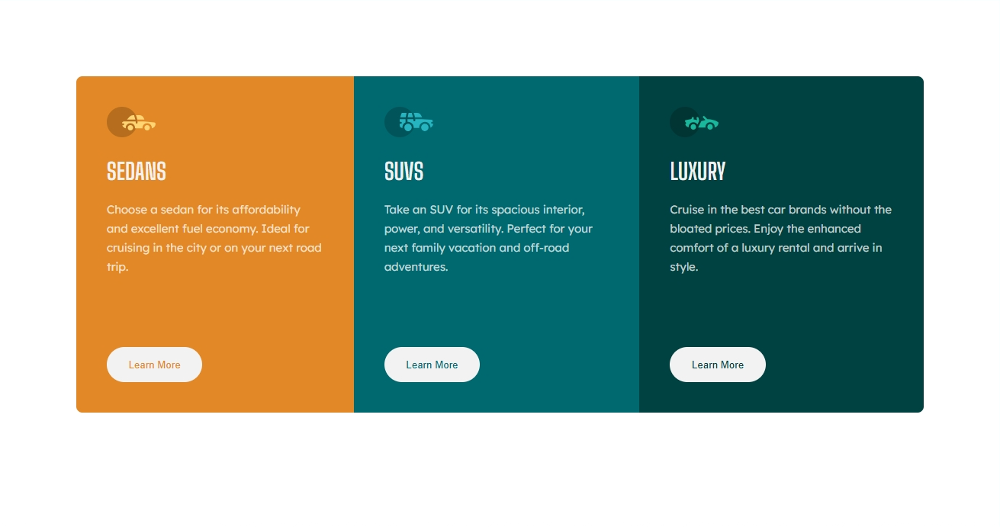
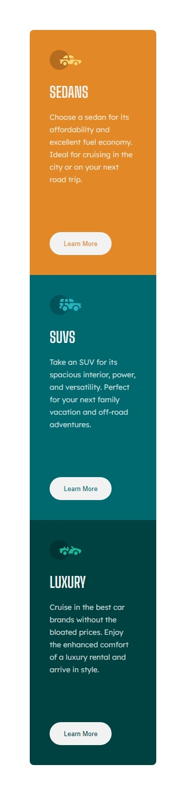

# Frontend Mentor - 3-column preview card component solution

This is a solution to the [3-column preview card component challenge on Frontend Mentor](https://www.frontendmentor.io/challenges/3column-preview-card-component-pH92eAR2-). Frontend Mentor challenges help you improve your coding skills by building realistic projects. 

## Table of contents

- [Overview](#overview)
  - [The challenge](#the-challenge)
  - [Screenshots](#screenshots)
- [My process](#my-process)
  - [Built with](#built-with)
  - [What I learnt](#what-i-learnt)
- [Author](#author)

## Overview

### The challenge

Users should be able to:

- View the optimal layout depending on their device's screen size
- See hover states for interactive elements

### Screenshots




## My process

### Built with

- Semantic HTML5 markup
- CSS custom properties
- Flexbox

### What I learnt

This one right here:

```css
button {
  transition: all 0.5s ease-in;
  &:hover {
    transform: translate(2px, -2px);
    color: hsl(0, 0%, 95%);
    background: none;
  }
}
```

## Author

- Github - [@harryjupiter148](https://github.com/harryjupiter148)
